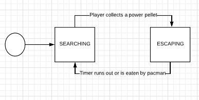

# ARCHITECTURE of goPACMAN

The pacman project is divided into several files. Each contains structures and functions related to a specific purpose within the game, which allows us to keep everything in a more organised fashion.

- constants.go:   Declares constants used in the game
- directions.go:  Declares the values related to the 4 cardinal directions characters can move in
- ghost.go:       Declares all the functions related to ther ghosts' behavior
- input.go:       Declares all the necessary functions for handling player input
- pacman.go:      Declares all the functions related to the main game loop
- player.go:      Declares all the functions related to player behavior
- world.go:       Declares all functions related to the level and the objects that inhabit it

Architecture
--------
Sequence diagram of the game

In the previous sequence diagram, we can see that there are 4 main structures that handle the game loop and logic.

### pacmanGame
pacmanGame is in charge of initialising the game. It is the main interface between the structures I created for the game and Ebiten's method's for initialising the rendering and the game itself.

### World
Perhaps the most important component of them all, the world contains references to all of the ghosts, the player and particularly, the level layout. The world is also in charge of managing and processing collisions and sending this information to the respective agents, so that they act accordingly. The world also draws the text to the bottom, and its in charge of telling every other object when to stop.

### Player
The player is the entity that listens to player input. The player moves accross the screen in the direction inputted by the user, collecting pellets in the way and incrementing the score. When the player collides with an object, the world registers it and sends a callback.

### Ghost
The ghosts initialise in their home spaces and immediately start wandering around the map randomly on their own thread. If a ghost is collided with, it kills the player and the world resets the level. Ghosts change their state when the player grabs a power pellet. Ghost states are fairly simple

## How are threads used?
Every relevant object that uses threads (player and ghosts) has a run method. This method is called only once, but as it runs on a separate thread, doesn't need to be waited on by the main thread. The main thread checks the values updated every tick of the thread. If the game is ended, the main thread sends a kill signal to all of the relevant objects through a channel, telling it to stop.

## Limitations
As the project was undertaken by one person in a limited scope of time, certain liberties and limitations were taken to make sure all of the technical requirements were met.
- There is no wraparound
- The refresh rate is once every second and goes cell by cell, instead of smoothly
- The collisions can be a little janky at times
- There are no animations
- AI behaviors were not implemented